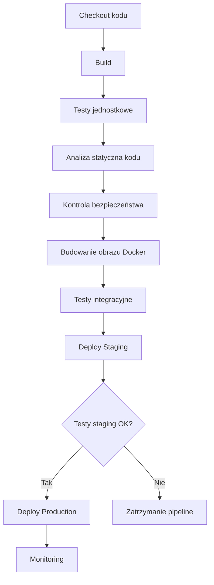

# Jenkins – Pipeline CI/CD

## Diagram Mermaid

```mermaid
flowchart TD
    A[Checkout kodu] --> B[Build]
    B --> C[Testy jednostkowe]
    C --> D[Analiza statyczna kodu]
    D --> E[Kontrola bezpieczeństwa]
    E --> F[Budowanie obrazu Docker]
    F --> G[Testy integracyjne]
    G --> H[Deploy Staging]
    H --> I{Testy staging OK?}
    I -->|Tak| J[Deploy Production]
    I -->|Nie| K[Zatrzymanie pipeline]
    J --> L[Monitoring]
```

Diagram przedstawia proces CI/CD od pobrania kodu z repozytorium do wdrożenia aplikacji na środowisko produkcyjne i monitorowania jej działania.